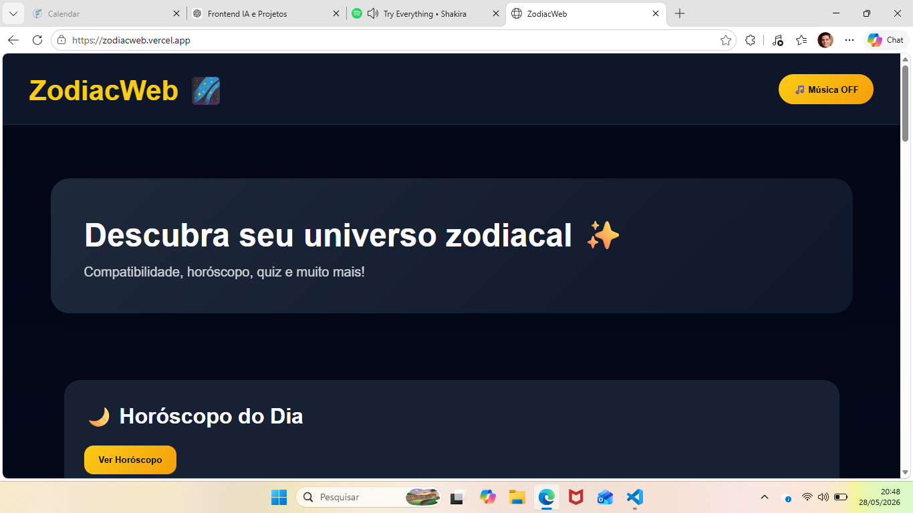
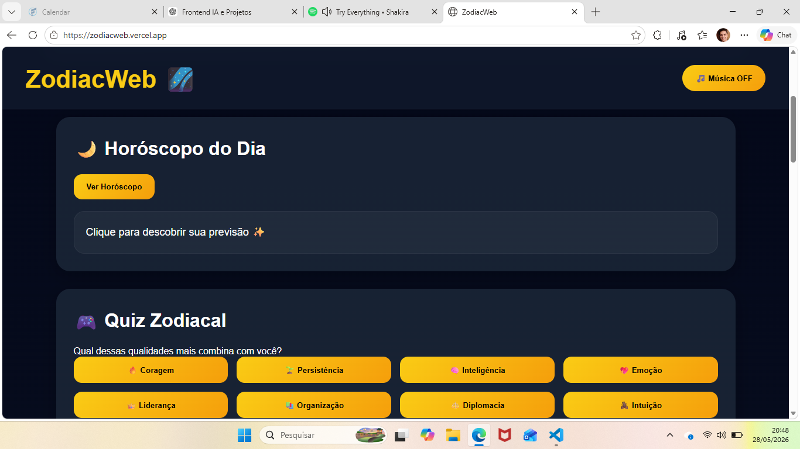
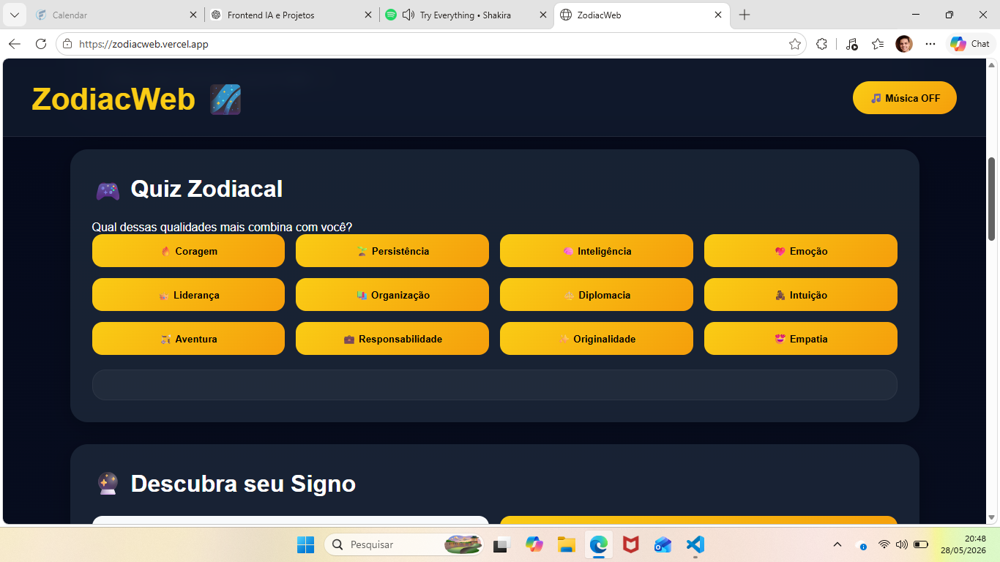
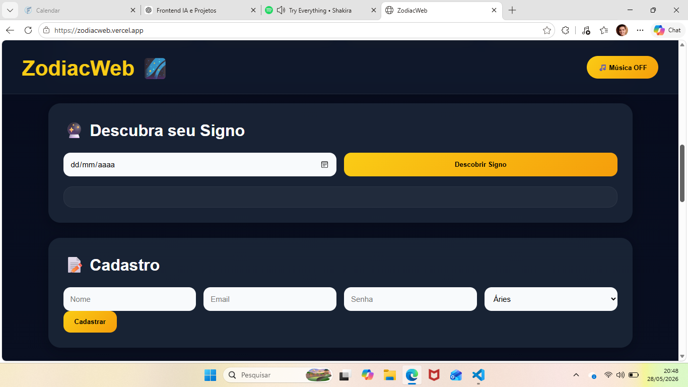
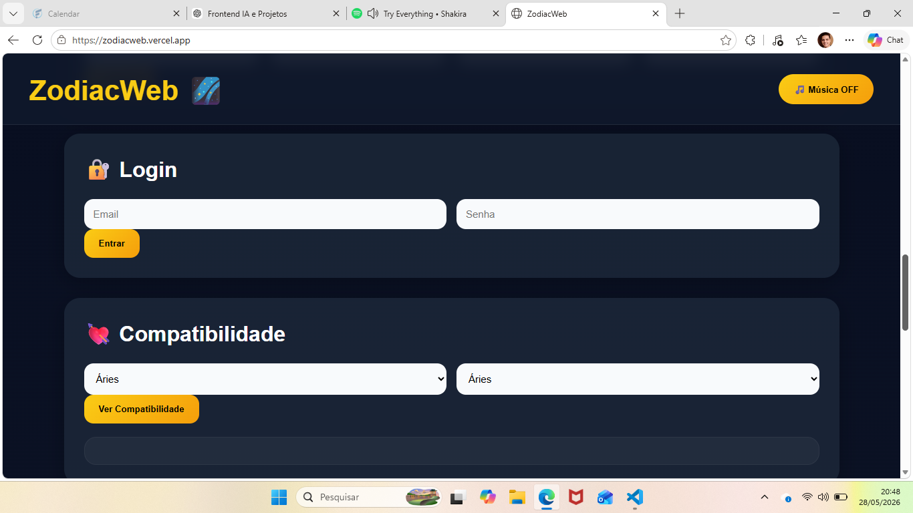
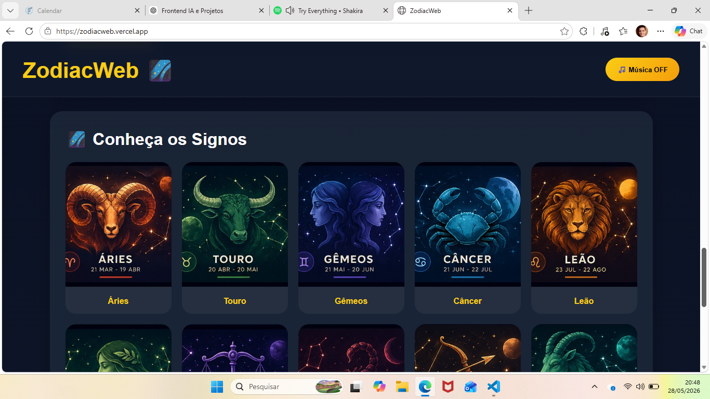
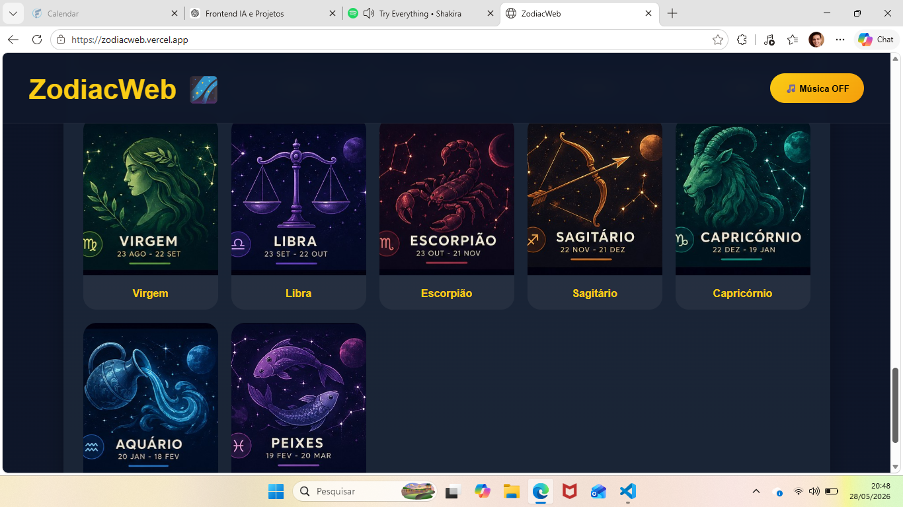

# 🌌 ZodiacWeb

Projeto Full Stack sobre astrologia, signos e horóscopo.

## 🚀 Funcionalidades

- Cadastro de usuários
- Login seguro com bcrypt
- Quiz zodiacal
- Compatibilidade entre signos
- Horóscopo
- Música ambiente
- Tema astral animado

## 🛠 Tecnologias

### Frontend
- HTML
- CSS
- JavaScript

### Backend
- Node.js
- Express
- MySQL

### Deploy
- Railway
- Netlify

## 🔐 Segurança

- Senhas criptografadas com bcrypt

## 🌍 Projeto Online

Frontend:
(https://app.netlify.com/projects/astonishing-treacle-c34e58/overview)

Backend:
(https://railway.com/project/5bc79c6c-b836-4f96-afe9-f703dbf35970?)

## 📸 Screenshots

## Observação:

- Você pode escolher a música de sua preferência, caso você queira alterar a música que eu escolhi!

## 👨‍💻 Autor

Tiago Henrique Moraes de Oliveira